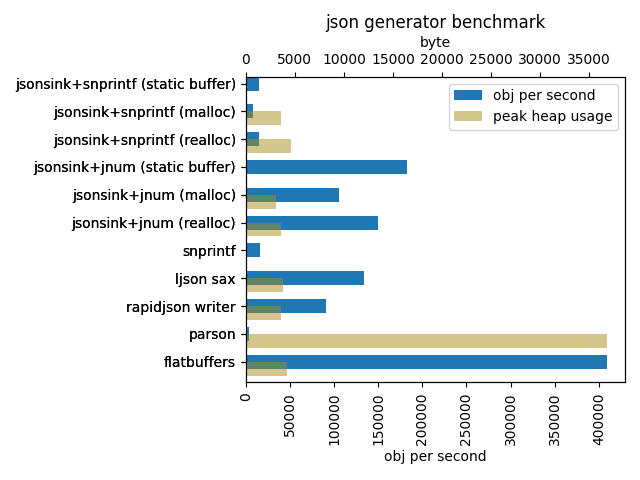

## What's this?

A small and fast JSON producer written in C.

## Goals

* Performance
  * No implicit heap allocations
* Correctness
* Clean code
* Small footprint
  * Be able to produce JSON larger than available memory
* Portability

## Non-goals

* Stable API/ABI
* Parser
* Validator
* DOM 

## Benchmark



* It measures the speed to generate JSON objects, an equivalent of
  [this](bench/example.json).

* Larger is better.

* Taken on a macOS/amd64 laptop:

  ```
  MacBook Pro (15-inch, 2018)
  2.2 GHz 6-Core Intel Core i7
  ```

* [Raw values](./bench/result.csv)

### Notes

* As the structural aspects of JSON (arrays and objects) are trivial,
  it seems that this benchmark ended up with measuring the performance
  of the conversion from binary numbers to strings. (itoa/dtoa)

  * `jsonsink+snprintf`, `parson`, and `snprintf` use libc snprintf for
  the conversion.

  * `jsonsink+jnum`, `rapidjson`, and `ljson` use more performant
    implementations of the conversion.

  * `flatbuffers` is very fast because it doesn't involve the conversions.

  * In case you are interested in this area, there are dedicated
    benchmarks out there.

    * https://github.com/miloyip/itoa-benchmark
    * https://github.com/miloyip/dtoa-benchmark
    * https://github.com/abolz/Drachennest

* `jsonsink (malloc)` is expected to be about twice slower than
  `jsonsink (static buffer)` because it calculates the necessay buffer size 
  with a dry-run.

* `flatbuffers` is not a fair comparison because it doesn't produce JSON.
  I included it just as a base line.
  The serialized object contains the equivalent of the JSON ones.
  (See its [schema](./bench/test.fbs).)

* `parson` is not a fair comparison because it uses a DOM-based api.

* `snprintf` is cheating a bit by using the apriori knowledge of
  the necessary buffer size.

### Benchmark code

* [jsonsink](./bench/jsonsink.c)

* [snprintf](./bench/snprintf.c)

* [ljson](./bench/ljson.c)

* [rapidjson](./bench/rapidjson.cxx)

* [parson](./bench/parson.c)

* [flatbuffers](./bench/flatbuffers.cxx)
