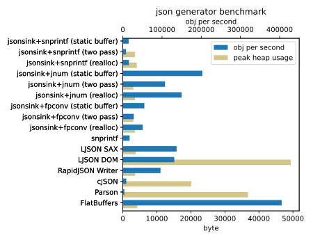

## What's this?

A small and fast JSON producer written in C.

## Goals

* Performance
  * No implicit heap allocations
* Correctness
  * If interoperability is not important, maybe you have better choices than JSON
* Small footprint
  * Be able to produce JSON larger than available memory
* Clean code
* Portability

## Non-goals

* Stable API/ABI
* Parser
* Validator
* DOM 

## Benchmark



* `obj per second`

  * Larger is better.

  * It measures the speed to generate JSON objects, an equivalent of
    [this](bench/example.json).
    The size of the JSON object is typically 2669 bytes. (It varies a bit
    among implementations because of different string representations of
    numbers.)

    In case of `flatbuffers`, it generates 1696 bytes binary data.

* `peak heap usage`

  * Smaller is better.

  * Measured with a simple [malloc interposer](bench/malloc_interposer.c).

* Taken on a macOS/amd64 laptop:

  ```
  MacBook Pro (15-inch, 2018)
  2.2 GHz 6-Core Intel Core i7
  ```

* [Raw values](./bench/result.csv)

### Notes

* As the structural aspects of JSON (arrays and objects) are trivial,
  it seems that this benchmark ended up with measuring the performance
  of the conversion from binary numbers to strings. (itoa/dtoa)

  * `jsonsink+snprintf`, `parson`, and `snprintf` use libc snprintf for
  the conversion.

  * `jsonsink+jnum`, `rapidjson`, and `ljson` use more performant
    implementations of the conversion.

  * `flatbuffers` is very fast because it doesn't involve the conversions.

  * In case you are interested in this area, there are dedicated
    benchmarks out there.

    * https://github.com/miloyip/itoa-benchmark
    * https://github.com/miloyip/dtoa-benchmark
    * https://github.com/abolz/Drachennest

* `jsonsink (static)` uses a small (64 bytes) static buffer.
  when the buffer gets full, it flushes the buffer.

* `jsonsink (malloc)` uses two-path strategy. It first calculates the
  size of JSON, allocate the buffer of the size with malloc(), and then
  generate JSON to the buffer. Thus it's expected to be about twice slower
  than `jsonsink (static buffer)`.

* `jsonsink (realloc)` extends the buffer using realloc() when it gets full.

* `flatbuffers` is not fair to compare directly because it doesn't produce JSON.
  I included it just as a base line.
  The serialized object contains the equivalent of the JSON ones.
  (See its [schema](./bench/test.fbs).)

* `cjson` and `parson` are not fair to compare directly because they use DOM-based apis.

* `snprintf` is cheating a bit by using the apriori knowledge of
  the necessary buffer size and using a large enough static buffer.

### Benchmark code

| test code                              | library
| -------------------------------------- | ------------------------------------------
| [jsonsink](./bench/jsonsink.c)         | https://github.com/yamt/jsonsink
| [snprintf](./bench/snprintf.c)         | libc snprintf
| [ljson](./bench/ljson.c)               | https://github.com/lengjingzju/json
| [rapidjson](./bench/rapidjson.cxx)     | https://github.com/Tencent/rapidjson/
| [cjson](./bench/cjson.c)               | https://github.com/DaveGamble/cJSON
| [parson](./bench/parson.c)             | https://github.com/kgabis/parson
| [flatbuffers](./bench/flatbuffers.cxx) | https://github.com/google/flatbuffers
